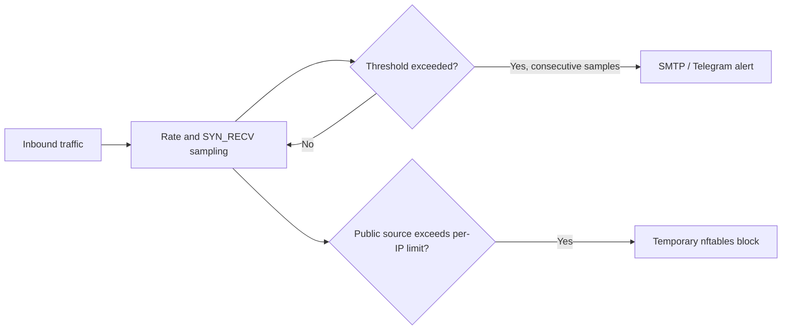

<div align="center">


# Mitigato

**Monitor traffic. Catch suspicious spikes. Alert your team. Temporarily block abusive sources.**

A lightweight Linux DDoS monitor with SMTP and Telegram notifications and basic nftables protection.

[**English**](README.md) · [Русский](README.ru.md)

[](LICENSE)
[](https://github.com/THWEDOKA/Mitigato/actions/workflows/ci.yml)


</div>

---

## What it does

Mitigato samples inbound packet and bit rates from `/proc/net/dev`, and counts half-open TCP connections (`SYN_RECV`) from `/proc/net/tcp` and `/proc/net/tcp6`. It alerts after a configurable number of consecutive samples over a threshold, sends a recovery notice, and limits repeat alerts with a cooldown.

When a **public** source IP exceeds the per-IP `SYN_RECV` threshold, Mitigato can add it to a temporary nftables block set. Trusted addresses and private addresses are never blocked automatically. Mitigato owns only its dedicated `inet mitigato` table; it does not change your existing firewall policy.

<div align="center">

</div>



## Quick install

**Requirements:** Linux with systemd, Python 3.11 or newer, and root access. The installer installs `nftables` through `apt`, `dnf`, or `pacman` if it is missing.

```bash
git clone https://github.com/THWEDOKA/Mitigato.git
cd Mitigato
sudo bash install.sh
```

The setup asks for SMTP and/or Telegram credentials and optional trusted management IPs. At least one notification channel is required. Credentials are stored in `/etc/mitigato/config.toml` with mode `0600`. The systemd service starts automatically.

```bash
sudo mitigato check                    # Validate configuration and interface
sudo mitigato test-alert               # Send a real test notification
systemctl status mitigato.service      # Check service health
journalctl -u mitigato.service -f      # Follow detections and errors
```

For Telegram, create a bot with [BotFather](https://t.me/BotFather), start a chat with it, and use that chat's ID. For SMTP, use a mail provider's TLS/SSL endpoint and an app password when required by the provider.

## Configuration

Edit `/etc/mitigato/config.toml`, then run `sudo systemctl restart mitigato.service`. See [config.example.toml](config.example.toml) for every setting.

| Setting | Default | Meaning |
| :--- | ---: | :--- |
| `monitor.interval_seconds` | `5` | Time between samples. |
| `monitor.packets_per_second` | `10000` | Inbound packet-rate alert threshold. |
| `monitor.bits_per_second` | `100000000` | Inbound bit-rate alert threshold (100 Mbit/s). |
| `monitor.syn_recv_total` | `500` | Total half-open TCP connection threshold. |
| `monitor.syn_recv_per_ip` | `100` | Per-source threshold; also triggers a temporary block. |
| `monitor.alert_after_samples` | `3` | Consecutive high samples before the first alert. |
| `firewall.block_seconds` | `600` | Block duration (10 minutes). |
| `firewall.trusted_ips` | `[]` | IPs/CIDRs excluded from automatic blocking. |

Set thresholds for **your** normal traffic. Start by watching the logs and using `firewall.enabled = false` if you want alerts without blocking. The default thresholds are starting values, not universal attack signatures.

## Operations

```bash
sudo mitigato run --once --no-firewall  # Inspect one sample without changing nftables
sudo nft list table inet mitigato       # Inspect active block sets
sudo systemctl stop mitigato.service    # Stop monitoring and remove its nftables table
sudo mitigato uninstall                 # Remove service and program; keep configuration
sudo mitigato uninstall --purge         # Also delete configuration and secrets
```

Mitigato is a **basic host-side signal and response tool**. It does not inspect application requests, distinguish every legitimate spike from an attack, or replace upstream DDoS mitigation. Automatic blocking is limited to public IPs with many `SYN_RECV` sockets; packet/bit-rate alerts alone do not block traffic.

## Development

Run the test suite with `python3 -m unittest discover -s tests -v`. The project uses only Python's standard library at runtime. Bug reports and ideas are welcome in [Issues](https://github.com/THWEDOKA/Mitigato/issues).

Licensed under [MIT](LICENSE).
