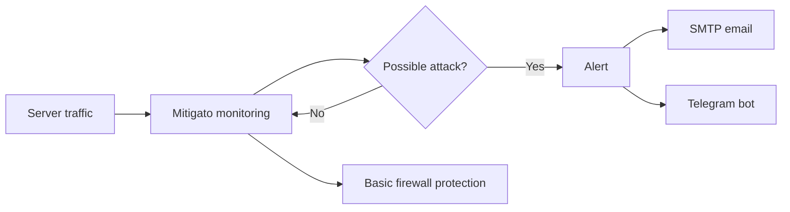

# Mitigato

**Spot a DDoS attack early. Get alerted. Apply a first line of defense.**

An upcoming server-side tool for quick setup, traffic monitoring, DDoS alerts, and basic firewall protection.

[**English**](README.md) · [Русский](README.ru.md)

---

## The idea

Install Mitigato on a server, finish a short setup, and keep an eye on its traffic. When the monitoring rules detect a possible DDoS attack, Mitigato will send an alert through your configured SMTP server and Telegram bot. Basic firewall rules will provide an initial layer of server protection.

| Planned capability | What it is for |
| :--- | :--- |
| ⚡ **Fast setup** | Install on a server and complete the initial configuration in a few steps. |
| 📈 **Traffic monitoring** | Watch for traffic patterns that may indicate a DDoS attack. |
| ✉️ **SMTP alerts** | Send attack notifications to a configured email destination. |
| 🤖 **Telegram alerts** | Notify operators through a configured Telegram bot. |
| 🛡️ **Firewall basics** | Apply basic server-side firewall protection. |

## Intended flow

## Project status

Mitigato is at the **early development** stage. This repository does not yet contain an installable release. The capabilities above describe the product direction, not shipped functionality. Installation commands and configuration examples will be added when an implementation is available.

### Roadmap

- [ ] Server installation and short setup flow
- [ ] Traffic monitoring and attack detection rules
- [ ] SMTP and Telegram alert delivery
- [ ] Basic firewall protection
- [ ] Installation, configuration, and operation guides

## Follow the project

Watch this repository for development updates. If you have a use case or a feature request, [open an issue](https://github.com/THWEDOKA/Mitigato/issues).

---

**Mitigato** · Made to make server protection easier to start.

