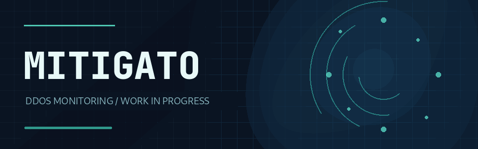
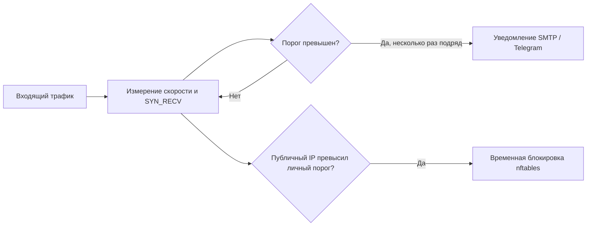

<div align="center">



# Mitigato

**Следите за трафиком. Замечайте подозрительные всплески. Получайте уведомления. Временно блокируйте источники атаки.**

Лёгкий монитор DDoS для Linux с уведомлениями по SMTP и в Telegram и базовой защитой через nftables.

[English](README.md) · [**Русский**](README.ru.md)

[](LICENSE)
[](https://github.com/THWEDOKA/Mitigato/actions/workflows/ci.yml)


</div>

---

## Возможности

Mitigato измеряет входящую скорость пакетов и бит по `/proc/net/dev` и считает незавершённые TCP-подключения (`SYN_RECV`) по `/proc/net/tcp` и `/proc/net/tcp6`. После заданного числа последовательных превышений порога он отправляет уведомление, сообщает о восстановлении и ограничивает частоту повторных оповещений.

Если у **публичного** IP-адреса превышен порог `SYN_RECV`, Mitigato может временно внести его в блокирующий набор nftables. Доверенные и частные адреса автоматически не блокируются. Программа управляет только собственной таблицей `inet mitigato` и не меняет общую политику файрвола.

<div align="center">

</div>



## Быстрая установка

**Требования:** Linux с systemd, Python 3.11 или новее и права root. Если `nftables` отсутствует, установщик добавит его через `apt`, `dnf` или `pacman`.

```bash
git clone https://github.com/THWEDOKA/Mitigato.git
cd Mitigato
sudo bash install.sh
```

Во время настройки укажите данные SMTP и/или Telegram и при необходимости доверенные IP-адреса для управления сервером. Нужен хотя бы один канал уведомлений. Секреты хранятся в `/etc/mitigato/config.toml` с правами `0600`. Сервис systemd запустится автоматически.

```bash
sudo mitigato check                    # Проверить конфигурацию и сетевой интерфейс
sudo mitigato test-alert               # Отправить настоящее тестовое уведомление
systemctl status mitigato.service      # Проверить состояние сервиса
journalctl -u mitigato.service -f      # Смотреть события и ошибки
```

Для Telegram создайте бота через [BotFather](https://t.me/BotFather), начните с ним диалог и укажите ID чата. Для SMTP используйте сервер с TLS/SSL и пароль приложения, если он требуется у почтового провайдера.

## Настройка

Отредактируйте `/etc/mitigato/config.toml`, затем выполните `sudo systemctl restart mitigato.service`. Все параметры есть в [config.example.toml](config.example.toml).

| Параметр | По умолчанию | Назначение |
| :--- | ---: | :--- |
| `monitor.interval_seconds` | `5` | Интервал измерений. |
| `monitor.packets_per_second` | `10000` | Порог входящих пакетов в секунду для уведомления. |
| `monitor.bits_per_second` | `100000000` | Порог входящей скорости в битах/с (100 Мбит/с). |
| `monitor.syn_recv_total` | `500` | Порог общего числа незавершённых TCP-подключений. |
| `monitor.syn_recv_per_ip` | `100` | Порог для одного источника; также включает временную блокировку. |
| `monitor.alert_after_samples` | `3` | Число последовательных превышений до первого уведомления. |
| `firewall.block_seconds` | `600` | Время блокировки (10 минут). |
| `firewall.trusted_ips` | `[]` | IP и сети, которые нельзя блокировать автоматически. |

Подберите пороги под **обычный трафик вашего сервера**. Сначала посмотрите журналы; для режима только с уведомлениями установите `firewall.enabled = false`. Значения по умолчанию — отправная точка, а не универсальные признаки атаки.

## Управление

```bash
sudo mitigato run --once --no-firewall  # Одно измерение без изменения nftables
sudo nft list table inet mitigato       # Посмотреть активные блокировки
sudo systemctl stop mitigato.service    # Остановить мониторинг и удалить его таблицу nftables
sudo mitigato uninstall                 # Удалить сервис и программу, сохранить конфигурацию
sudo mitigato uninstall --purge         # Также удалить конфигурацию и секреты
```

Mitigato — **базовый инструмент наблюдения и реагирования на самом сервере**. Он не анализирует запросы приложений, не отличает любой обычный всплеск трафика от атаки и не заменяет защиту на стороне провайдера. Автоматическая блокировка применяется только к публичным IP с большим числом `SYN_RECV`; превышение скорости пакетов или бит само по себе трафик не блокирует.

## Разработка

Запуск тестов: `python3 -m unittest discover -s tests -v`. Для работы программы нужны только модули стандартной библиотеки Python. Сообщения об ошибках и идеи можно оставить в [Issues](https://github.com/THWEDOKA/Mitigato/issues).

Лицензия — [MIT](LICENSE).
