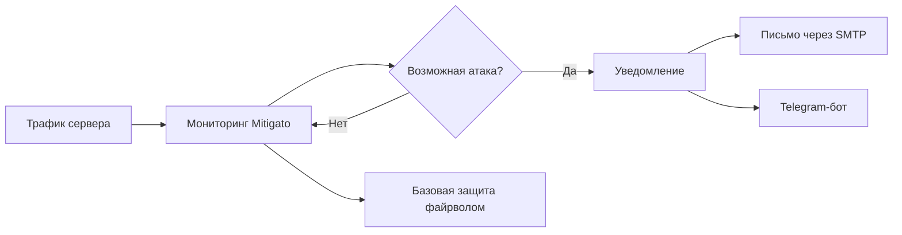

# Mitigato

**Замечайте DDoS-атаки раньше. Получайте уведомления. Включайте базовую защиту.**

Будущий серверный инструмент для быстрой настройки, мониторинга трафика, уведомлений о DDoS-атаках и базовой защиты через файрвол.

[English](README.md) · [**Русский**](README.ru.md)

---

## Идея

Установите Mitigato на сервер и пройдите короткую настройку. Инструмент будет следить за трафиком. Если правила мониторинга обнаружат возможную DDoS-атаку, Mitigato отправит уведомление через настроенный SMTP-сервер и Telegram-бота. Базовые правила файрвола обеспечат начальный уровень защиты сервера.

| Планируемая возможность | Для чего нужна |
| :--- | :--- |
| ⚡ **Быстрая настройка** | Установка на сервер и первоначальная настройка за несколько шагов. |
| 📈 **Мониторинг трафика** | Отслеживание признаков возможной DDoS-атаки. |
| ✉️ **Уведомления по SMTP** | Отправка сообщений об атаке на указанную почту. |
| 🤖 **Уведомления в Telegram** | Оповещение через настроенного Telegram-бота. |
| 🛡️ **Базовые правила файрвола** | Начальный уровень защиты на самом сервере. |

## Как это будет работать

## Состояние проекта

Mitigato находится на **ранней стадии разработки**. В репозитории пока нет версии, которую можно установить. Возможности выше описывают планы, а не готовые функции. Команды установки и примеры конфигурации появятся вместе с реализацией.

### План разработки

- [ ] Установка на сервер и короткая первоначальная настройка
- [ ] Мониторинг трафика и правила обнаружения атак
- [ ] Отправка уведомлений по SMTP и в Telegram
- [ ] Базовая защита через файрвол
- [ ] Инструкции по установке, настройке и использованию

## Следите за проектом

Подпишитесь на репозиторий, чтобы узнавать о ходе разработки. Идеи и пожелания можно [оставить в Issues](https://github.com/THWEDOKA/Mitigato/issues).

---

**Mitigato** · Чтобы защиту сервера было проще начать.

